# RAG-QA System Architecture

This document contains the architecture diagram for the RAG-QA system.

## System Architecture

```mermaid
flowchart TB
    subgraph Client["Client Layer"]
        U[("👤 User")]
        U -->|"POST /upload"| UP[Upload Endpoint]
        U -->|"POST /ask"| ASK[Ask Endpoint]
        U -->|"GET /documents"| DOC[Documents Endpoint]
    end
    
    subgraph API["FastAPI Server"]
        UP --> RL{{"Rate Limiter<br/>(10 req/min)"}}
        ASK --> RL
        DOC --> RL
        
        RL --> VAL["Pydantic<br/>Validation"]
    end
    
    subgraph Ingestion["Document Ingestion Pipeline"]
        direction TB
        BG["🔄 Background Task"]
        
        BG --> P["📄 Document Parser"]
        P -->|"PDF"| FITZ["PyMuPDF<br/>(fitz)"]
        P -->|"TXT"| TXT["Text Reader"]
        
        FITZ --> CH
        TXT --> CH
        
        CH["✂️ Text Chunker<br/>(512 chars, 50 overlap)"]
        CH --> EMB["🔢 Embedding Service<br/>(Gemini embedding-001)"]
        EMB --> VS
    end
    
    subgraph Storage["Storage Layer"]
        VS[("🗄️ FAISS<br/>Vector Store")]
        DS[("📁 Document Store<br/>(JSON)")]
        FS[("📂 File Storage")]
    end
    
    subgraph Retrieval["Query Pipeline"]
        direction TB
        QE["🔢 Query Embedding"]
        SS["🔍 Similarity Search<br/>(FAISS IndexFlatIP)"]
        CT["📋 Context Builder"]
        
        QE --> SS
        SS --> CT
    end
    
    subgraph Generation["Answer Generation"]
        LLM["🤖 Gemini LLM<br/>(gemini-1.5-flash)"]
        ANS["📝 Answer + Sources"]
        
        CT --> LLM
        LLM --> ANS
    end
    
    %% Connections
    VAL -->|"File Upload"| BG
    BG --> DS
    BG --> FS
    EMB --> VS
    
    VAL -->|"Question"| QE
    SS <--> VS
    
    ANS -->|"Response"| U
```

## Data Flow

### Document Upload Flow

### Question Answering Flow

## Component Diagram

## Technology Stack

| Layer | Technology | Purpose |
|-------|------------|---------|
| **API Framework** | FastAPI | High-performance async API |
| **Validation** | Pydantic | Request/response validation |
| **Rate Limiting** | slowapi | Request throttling |
| **PDF Parsing** | PyMuPDF | Extract text from PDFs |
| **Embeddings** | Google Gemini API | Text vectorization |
| **Vector Store** | FAISS | Similarity search |
| **LLM** | Google Gemini | Answer generation |
| **Background Tasks** | FastAPI BackgroundTasks | Async document processing |
