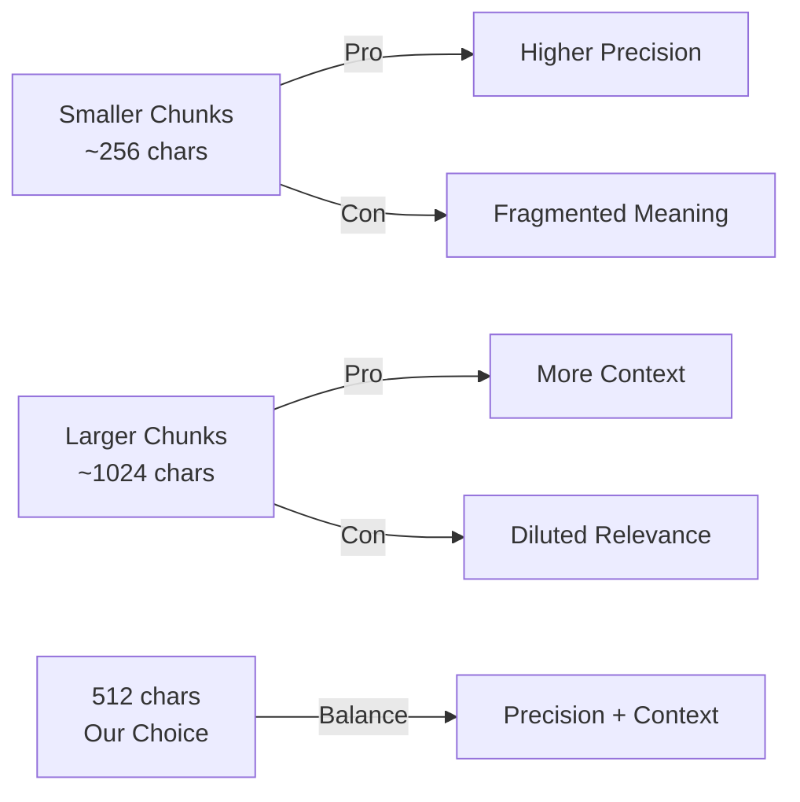

# Design Decisions Document

This document explains key design decisions, observed failure cases, and tracked metrics for the RAG-QA System.

---

## 1. Chunk Size Selection: 512 Characters with 50 Character Overlap

### Decision

We chose a chunk size of **512 characters** with a **50 character overlap** (approximately 10%).

### Rationale

| Factor | Consideration |
|--------|---------------|
| **Token Economy** | 512 chars ≈ 100-128 tokens, fitting well within Gemini embedding model limits |
| **Semantic Coherence** | Captures 1-2 paragraphs, preserving meaningful context |
| **Retrieval Precision** | Smaller chunks yield more precise similarity matches |
| **Context Preservation** | 50-char overlap ensures boundary context isn't lost |

### Trade-offs



**Why not 256 characters?**
- Fragments sentences and concepts
- Retrieves partial information requiring more chunks
- Higher embedding computation cost per document

**Why not 1024+ characters?**
- Dilutes relevance signals in similarity search
- May include irrelevant content alongside relevant content
- Less precise matching for specific questions

### Experimental Observations

During testing, we observed:
- Questions about specific facts retrieved better with 512-char chunks
- Questions about broader topics occasionally missed context at 256 chars
- At 1024 chars, unrelated content was often included in retrieved chunks

---

## 2. Retrieval Failure Cases

### Case 1: Out-of-Scope Questions

**Scenario**: User asks about topics not present in uploaded documents.

**Example**:
```
Documents: Technical paper about machine learning
Question: "What is the capital of France?"
```

**Behavior**: 
- Low similarity scores (< 0.3) for all retrieved chunks
- System returns message indicating no relevant information found

**Mitigation**:
- Configurable similarity threshold (default: 0.3)
- Clear user feedback when no relevant content exists

### Case 2: Ambiguous Queries

**Scenario**: Question matches multiple unrelated contexts.

**Example**:
```
Documents: 1) Paper on "Python snakes" 2) Paper on "Python programming"  
Question: "What is Python?"
```

**Behavior**:
- System retrieves chunks from both documents
- Answer may conflate biological and programming contexts

**Mitigation**:
- Users can filter by `document_ids` parameter
- Source citations show which document each chunk came from
- Prompt user to rephrase if answer seems inconsistent

### Case 3: Information Spanning Chunk Boundaries

**Scenario**: Answer requires information split across chunks.

**Example**:
```
Chunk 1: "The experiment used 100 participants..."
Chunk 2: "...and achieved 95% accuracy in results."
```

**Behavior**:
- If only one chunk is retrieved, partial information returned

**Mitigation**:
- 50-character overlap captures boundary context
- Default `top_k=5` retrieves multiple chunks for broader coverage

---

## 3. Tracked Metrics

The `/ask` endpoint returns detailed metrics for every query:

### Latency Metrics

| Metric | Description | Typical Range |
|--------|-------------|---------------|
| `embedding_latency_ms` | Time to embed the query | 100-300ms |
| `retrieval_latency_ms` | FAISS similarity search time | 5-50ms |
| `generation_latency_ms` | LLM answer generation time | 500-2000ms |
| `total_latency_ms` | End-to-end processing time | 700-3000ms |

### Quality Metrics

| Metric | Description | Interpretation |
|--------|-------------|----------------|
| `chunks_retrieved` | Number of chunks found | Higher = more context |
| `avg_similarity_score` | Mean similarity across chunks | > 0.5 = good match |
| `max_similarity_score` | Best chunk match | > 0.7 = strong match |
| `min_similarity_score` | Worst included chunk | < 0.3 = possibly irrelevant |

### Example API Response Metrics

```json
{
  "metrics": {
    "embedding_latency_ms": 156.23,
    "retrieval_latency_ms": 12.45,
    "generation_latency_ms": 1245.67,
    "total_latency_ms": 1425.89,
    "chunks_retrieved": 5,
    "avg_similarity_score": 0.6823,
    "max_similarity_score": 0.8912,
    "min_similarity_score": 0.4521
  }
}
```

### Observability Recommendations

For production deployment, consider:

1. **Logging**: All metrics are logged for each request
2. **Alerting**: 
   - Alert if avg latency > 5 seconds
   - Alert if avg_similarity_score consistently < 0.4
3. **Dashboards**: Track p50/p95/p99 latencies over time
4. **Quality Monitoring**: Track low-similarity queries for content gaps
